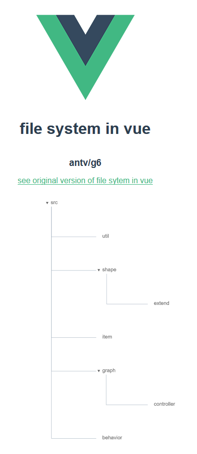

# antv-g6-in-vue

[see original version of file sytem in antv/g6](https://antv.alipay.com/zh-cn/g6/3.x/demo/tree/tree-indented.html)



## Project setup
```
yarn install
```

### Compiles and hot-reloads for development
```
yarn run serve
```

### Compiles and minifies for production
```
yarn run build
```

### Run your tests
```
yarn run test
```

### Lints and fixes files
```
yarn run lint
```

### Customize configuration
See [Configuration Reference](https://cli.vuejs.org/config/).

